## {data-background="portada.png"}

## *Salvia stachydifolia* Benth. {data-background="fondo.png"}
 <small>Sistema mixto de polinización.</small>
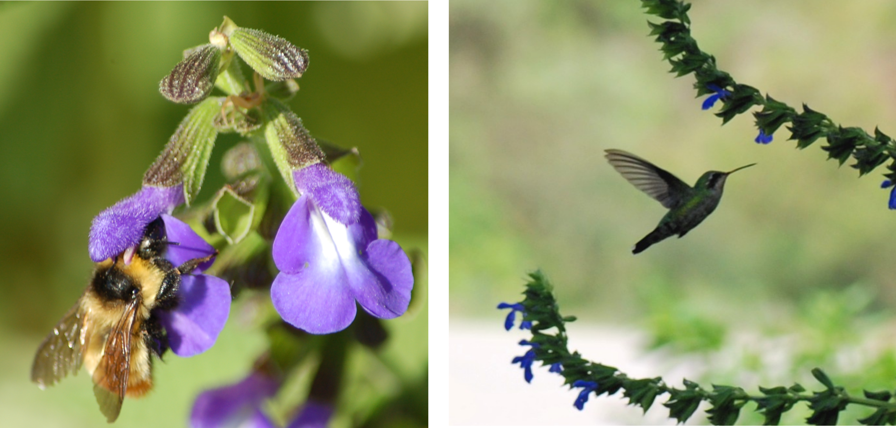

## {data-background="fondo.png"}
La especie se encuentra a más de 1500 metros de altura.   
Dentro de la ecorregión de las Yungas.
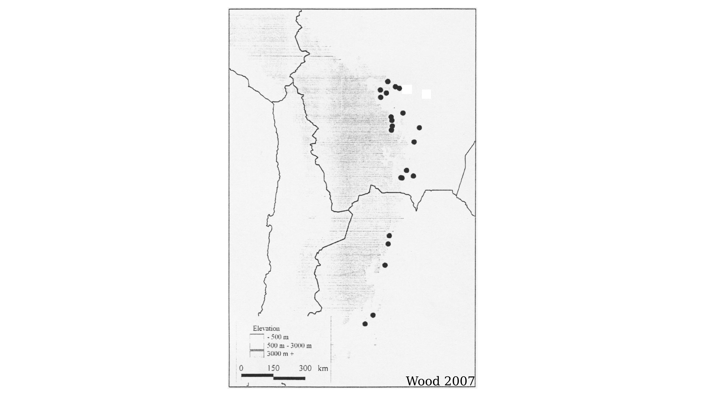

## Hipótesis {data-background="fondo.png"}

 En poblaciones naturales con diferente proporción de visitas de polinizadores (abejas vs. colibríes), existirán patrones divergentes tanto en la morfología floral como en las características del néctar y en el éxito reproductivo. Estas diferencias llevarían a un aislamiento reproductivo parcial entre las poblaciones.

## Objetivo general {data-background="fondo.png"}

 Examinar si las diferencias en los grupos de polinizadores y sus presiones selectivas particulares afectan el grado de aislamiento reproductivo y diferenciación morfológica entre poblaciones, y si este efecto es independiente del tiempo de divergencia entre estas poblaciones.

## Objetivos específicos {data-transition="none" data-background="fondo.png"}

 1- Caracterizar la variabilidad y divergencia de poblaciones *S. stachydifolia*: morfología, producción de néctar y la arquitectura de la inflorescencia.   
<!-- blank line -->
 
<!-- blank line -->

 2- Caracterizar los ensambles de polinizadores, que constituyen el contexto ecológico de selección divergente.   
<!-- blank line -->
 
<!-- blank line -->

 3- Caracterizar la divergencia genética entre poblaciones utilizando marcadores neutrales.

## Objetivos específicos {data-transition="none" data-background="fondo.png"}

 1- Caracterizar la variabilidad y divergencia de poblaciones *S. stachydifolia*: morfología, producción de néctar y la arquitectura de la inflorescencia.   
<!-- blank line -->
 
<!-- blank line -->

 2- Caracterizar los ensambles de polinizadores, que constituyen el contexto ecológico de selección divergente.   
<!-- blank line -->
 
<!-- blank line -->

 3- Caracterizar la divergencia genética entre poblaciones utilizando marcadores neutrales.

## Objetivos específicos {data-transition="none" data-background="fondo.png"}

 1- Caracterizar la variabilidad y divergencia de poblaciones *S. stachydifolia*: morfología, producción de néctar y la arquitectura de la inflorescencia.   
<!-- blank line -->
 
<!-- blank line -->

 2- Caracterizar los ensambles de polinizadores, que constituyen el contexto ecológico de selección divergente.   
<!-- blank line -->
 
<!-- blank line -->

 3- Caracterizar la divergencia genética entre poblaciones utilizando marcadores neutrales.

## Objetivos específicos {data-transition="none" data-background="fondo.png"}

 4- Determinar el grado de aislamiento reproductivo entre las poblaciones.   
<!-- blank line -->
 
<!-- blank line -->

 5- Examinar la presencia de correlaciones entre el aislamiento reproductivo y las divergencias fenotípicas, ecológicas, genéticas y geográficas, para poner a prueba un modelo de aislamiento por adaptación.   
<!-- blank line -->
 
<!-- blank line -->

 6- Estimar la selección natural mediada por polinizadores y establecer la eficacia de ambos gremios de polinizadores.

## Objetivos específicos {data-transition="none" data-background="fondo.png"}

 4- Determinar el grado de aislamiento reproductivo entre las poblaciones.   
<!-- blank line -->
 
<!-- blank line -->

 5- Examinar la presencia de correlaciones entre el aislamiento reproductivo y las divergencias fenotípicas, ecológicas, genéticas y geográficas, para poner a prueba un modelo de aislamiento por adaptación.    
<!-- blank line -->
 
<!-- blank line -->

 6- Estimar la selección natural mediada por polinizadores y establecer la eficacia de ambos gremios de polinizadores.
   
## Objetivos específicos {data-transition="none" data-background="fondo.png"}

 4- Determinar el grado de aislamiento reproductivo entre las poblaciones.   
<!-- blank line -->
 
<!-- blank line -->

 5- Examinar la presencia de correlaciones entre el aislamiento reproductivo y las divergencias fenotípicas, ecológicas, genéticas y geográficas, para poner a prueba un modelo de aislamiento por adaptación.   
<!-- blank line -->
 
<!-- blank line -->

 6- Estimar la selección natural mediada por polinizadores y establecer la eficacia de ambos gremios de polinizadores.
   
## {data-background="fondo.png"}
Visita de Herbarios CORD (Córdoba) y LIL (Tucumán) 

## {data-transition="none" data-background="fondo1.png"}
### **Néctar**:
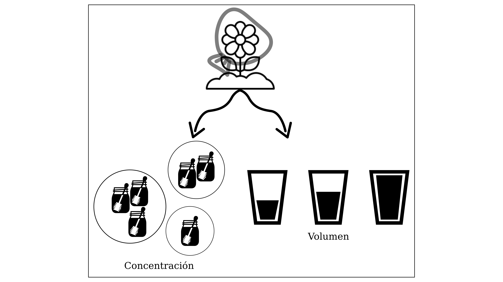   
  

## {data-transition="none" data-background="fondo1.png"}
### **Néctar**:
Caracterización del néctar de *S. stachydifolia*
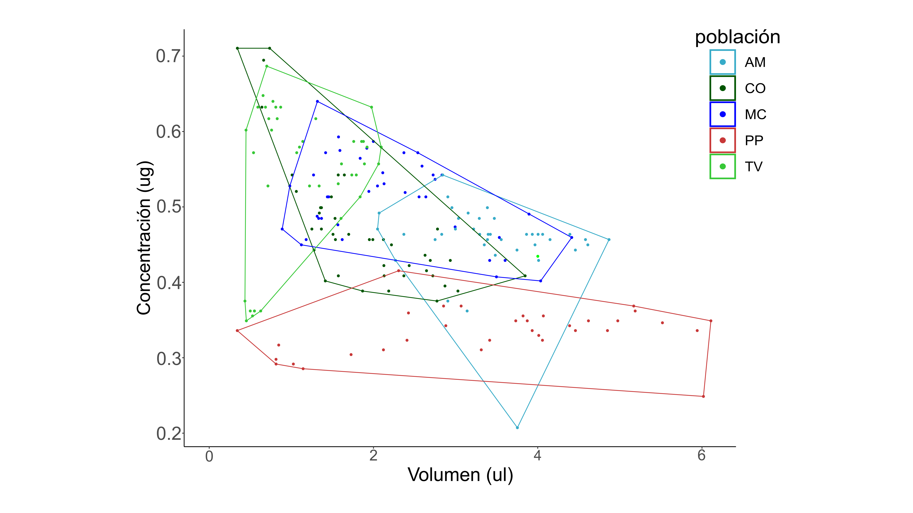

## {data-transition="none" data-background="fondo1.png"}
### **Néctar**:
Comparación de las características del néctar entre las poblaciones.
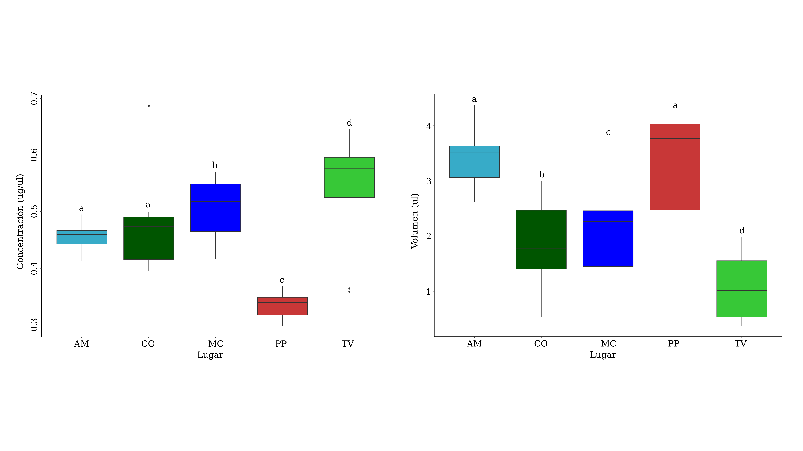

## {data-transition="none" data-background="fondo1.png"}
### **Morfometría Geométrica**:

<small>Se usó el paquete Geomorph  </small>

## {data-transition="none" data-background="fondo1.png"}
### **Morfometría Geométrica**:
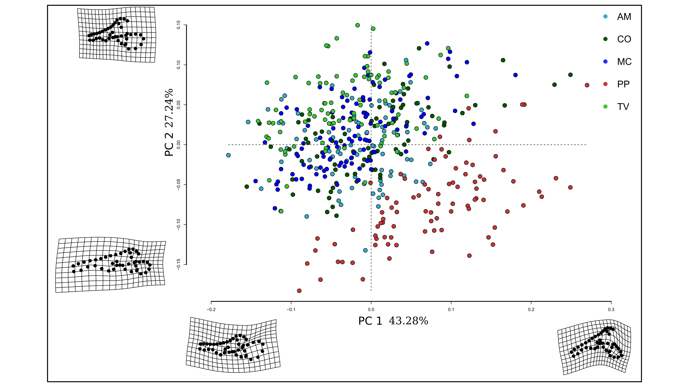

## {data-transition="none" data-background="fondo1.png"}
### **Morfometría Geométrica**:
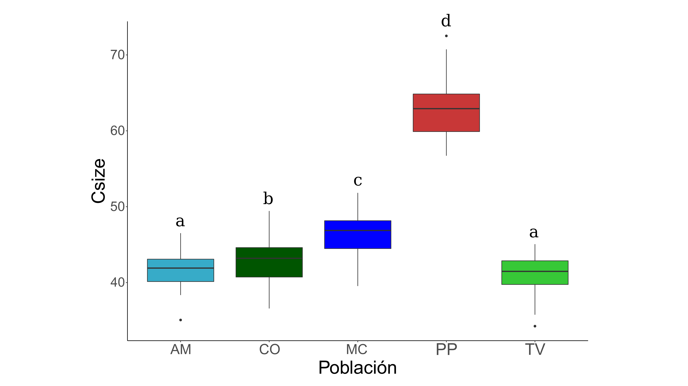

## {data-background="fondo2.png"}
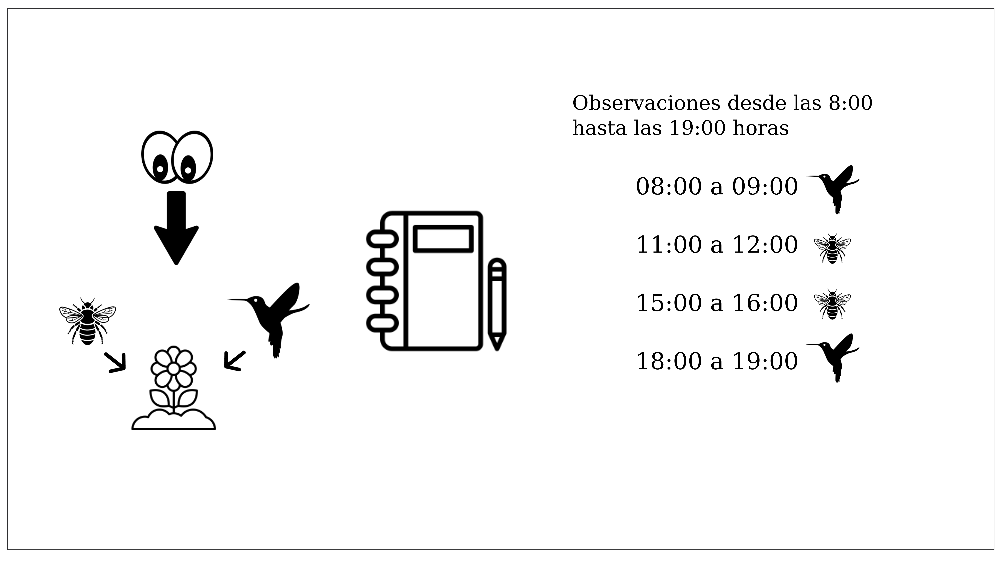

## Polinizadores más frecuentes {data-transition="none" data-background="fondo2.png"}

## Polinizadores más frecuentes {data-transition="none" data-background="fondo2.png"}

## Polinizadores más frecuentes {data-transition="none" data-background="fondo2.png"}

## Tasa de visitas {data-background="fondo2.png"}
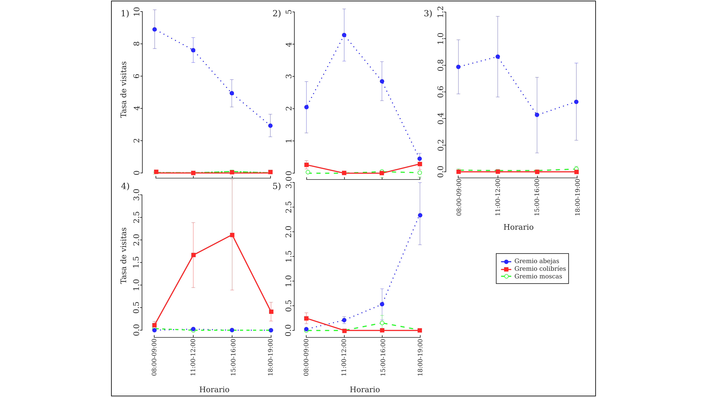

## Caracterización de las poblaciones {data-background="fondo2.png"}

## {data-background="fondo5.png"}

**Distancia geográfica:** medida en Google Maps de las distancias entre las poblaciones visitadas.   
   
   
**Distancia fenotípicas:** fueron divididas en tres: néctar, forma y tamaño.   
   
   
**Distancia ecológica:** se estimó como la similitud proporcional entre los ensambles de polinizadores de cada población.   
<!-- blank line -->
 
<!-- blank line -->

<small> Se estimaron las matrices de distancias respectivas y posteriormente se calcularon los test estadísticos de Procrustes, *Mantel* y Parcial de Mantel.</small>

## Néctar {data-background="fondo5.png"}
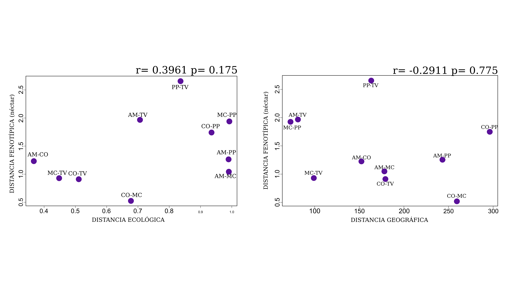

## Forma floral {data-background="fondo5.png"}
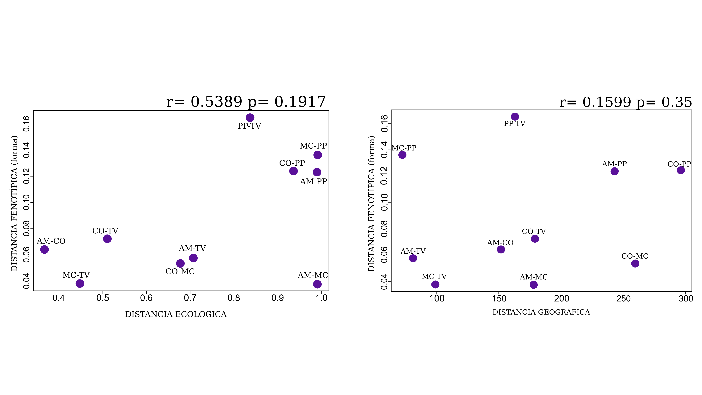

## Tamaño floral {data-background="fondo5.png"}
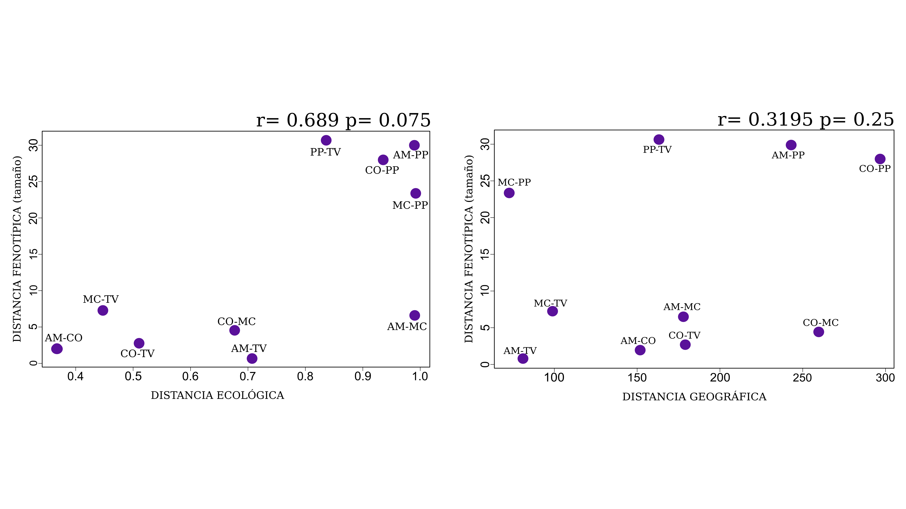 

## {data-background="fondo3.png"}

<small> Diseño de microsatélites en colaboración con Dra. Fernanda Pérez del Departamento de Ecología de la Pontificia Universidad Católica de Chile.</small> 

## {data-background="fondo4.png"}

<small> Umbráculo en el IMBIV con individuos de la población de Tafí del Valle.</small>

## {data-background="fondo8.png"}

## En campo {data-background="fondo.png"}

Aumentar el número de poblaciones, preferentemente las que se encuentran al norte de la
distribución de la especie.
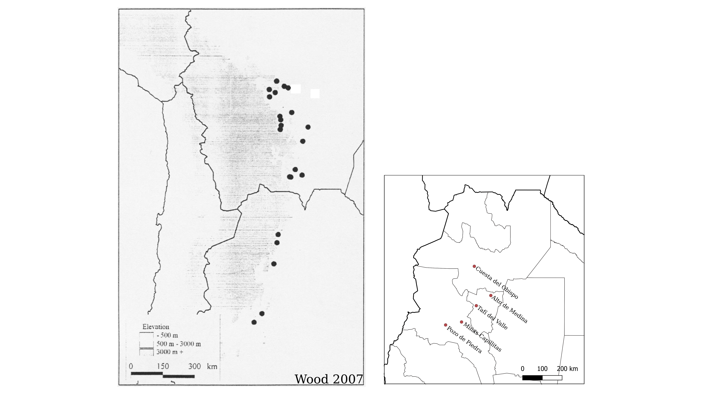

## {data-background="fondo.png"}
- Caracterización fenotípica.   
<!-- blank line -->
 
<!-- blank line -->
- Caracterizar ensambles de polinizadores.   
<!-- blank line -->
 
<!-- blank line -->
- Recolección de hojas para extracción de ADN, diseño de microsatélites específicos para la especie, secuenciar y realizar el genotipado de los individuos.

## En campo {data-background="fondo.png"}

Experimentos de selección en poblaciones caracterizadas.

## En invernadero {data-background="fondo.png"}

Experimentos manipulativos de aislamiento reproductivo.

## {data-background="fondo.png"}

Buscar información de requerimiento nutricional de los polinizadores para compara con datos medidos de nectar en las distintas poblaciones.   
<!-- blank line -->
 
<!-- blank line -->

Buscar información de tamaño de cada una de las abejas para compara las poblaciones caracterizadas como melitófilas.

## {data-background="fondo.png"}

Estudiar la diparidad entre poblaciones, principalmente para explicar la variación en la poblacion ornitófila.
 

## {data-background="fondo7.png"}